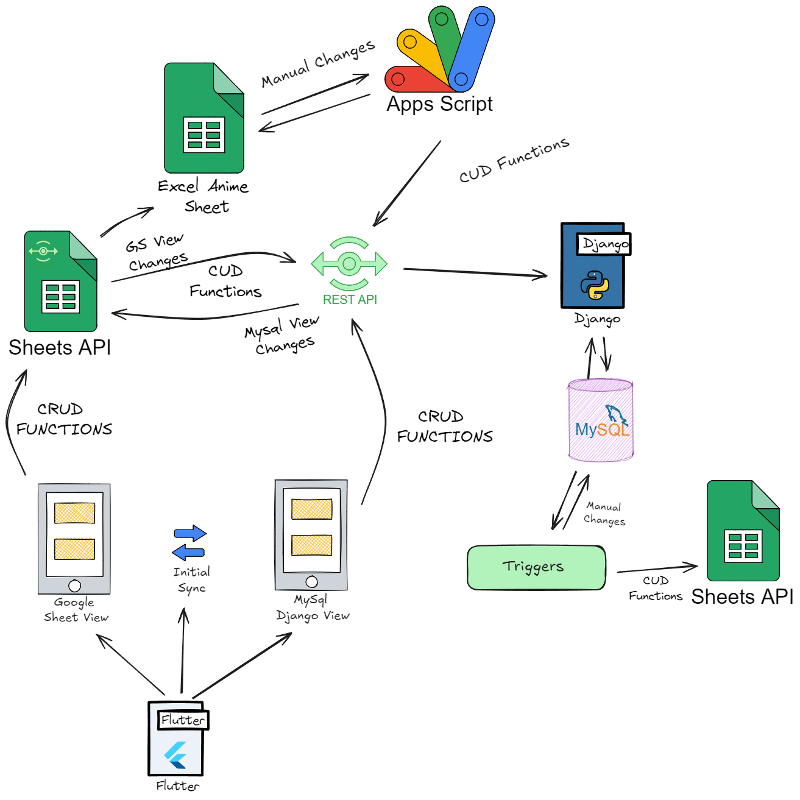
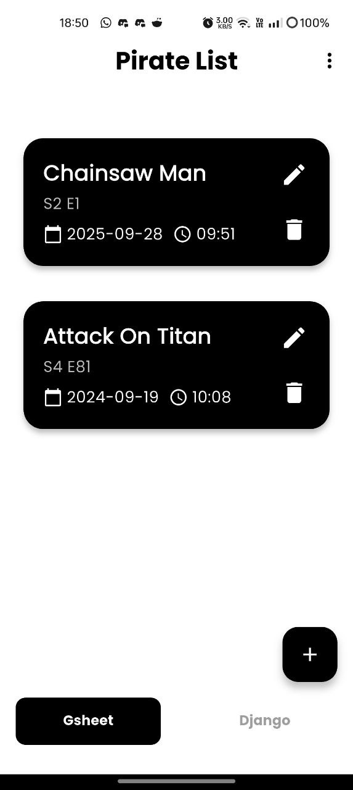
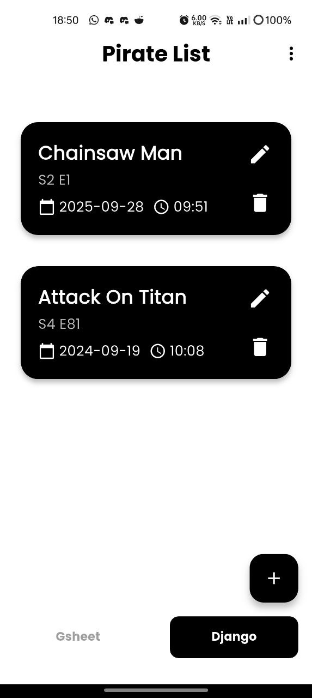
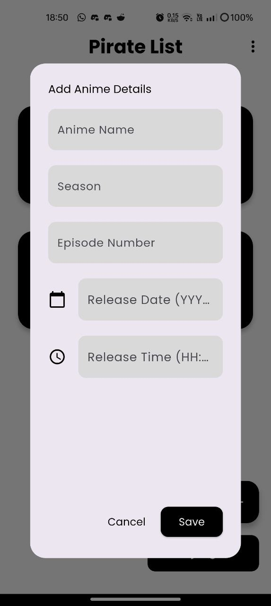
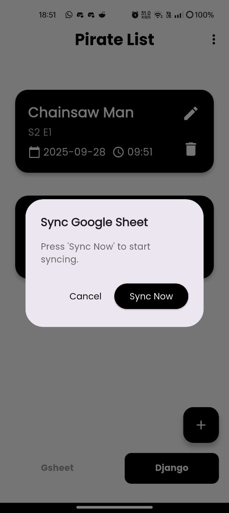
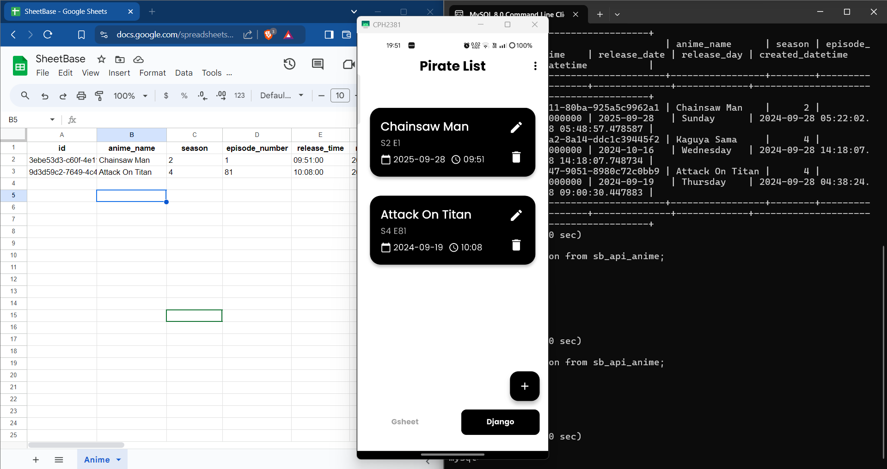

# Sync Google Sheets and Local SQL Database

## Introduction

This Flutter application connects to a MySQL database via a Django server, enabling seamless data management and synchronization with Google Sheets. Users can perform full CRUD operations on both data sources through an intuitive interface. The app supports real-time synchronization, ensuring that any changes made in either the database or Google Sheets are reflected across both platforms. Featuring an initial sync for data reconciliation and a "Last Write Wins" conflict resolution strategy, this project demonstrates effective integration of modern technologies, providing a robust solution for data handling in mobile applications.

## Working Approach Diagram

This diagram illustrates the architecture and workflow of the application, showcasing the interaction between the Flutter app, Django server, MySQL database, and Google Sheets.

## Approach Explanation

1. **User Interface**
   - The Flutter application contains two tabs: one retrieves and displays data from the Django server (MySQL), and the other displays data from Google Sheets.

2. **CRUD Functionality**
   - Users can perform CRUD operations through the app for both MySQL and Google Sheets.
   - For MySQL, I utilized Django Rest Framework, and for Google Sheets, I used the Google API services.

3. **Initial Synchronization**
   - An initial sync button is provided for first-time connections between the database and Google Sheets.
   - During this sync, I perform a set subtraction between Google Sheet data and MySQL data to identify and update only the new or missing data in both systems.
   - If different data (in non-primary key attributes of the table) is present but the same primary key value, only the most recent updates are added to both the database and the Google Sheet (technically last write wins).

4. **Working Approach**
   - After syncing, changes are sent to both Google Sheets and the Django Rest API for Create, Update, and Delete operations. This involves making API calls to update both systems based on detected changes.

5. **Manual Synchronization**
   - For MySQL updates, data can be sent to the Django Rest API using Google Apps Script.
   - For Google Sheets updates, if changes are made in the database, triggers will populate an `anime_log` table. A Celery task checks this table every minute to update Google Sheets based on the changes (Create, Update, Delete).

6. **Challenges**
   - I planned to use triggers through Google Apps Script to receive any changes to the database via my Ngrok-exposed URL. However, this did not work as intended, since only manual edits in Google Sheets trigger the `onEdit` function in Apps Script.
   - Manual changes in Google Sheets are reflected in MySQL through Apps Script, but automatic synchronization (changes made through API in Google Sheets) to MySQL remains a challenge.
   - For manual changes in MySQL, I used triggers to call procedures for sending changes to the Google Sheets API, but this also encountered limitations because MySQL does not allow sending data to external services directly (though solutions exist using external libraries but they are not recommended).

## Requirements Fulfilled

- ✅ Real-time synchronization established between Google Sheets and MySQL.
- ✅ Full CRUD operations implemented for both data sources.
- **Optional conflict resolution:** Implemented a **Last Write Wins** strategy, where updates are determined by the most recent timestamp. This approach efficiently resolves conflicts by ensuring that the latest data is preserved, reducing data inconsistency.

## Tech Stack

- Flutter
- Google APIs for Google Sheets
- Django
- Django Rest Framework
- MySQL
- Celery
- Ngrok

## Flutter Demo

    
    
    
    

## Django Environment Setup

1. Navigate to the `django_backend` directory.
2. Run `pipenv install` to install the required dependencies.
3. Activate the virtual environment using `pipenv shell` and start the Django server with `python manage.py runserver`.

## Google Drive Link

- Access the project video [here](https://drive.google.com/file/d/1JOpu7G9xfpo97xlIuWla9M5ZJpCCMZiu/view?usp=sharing).

## Video Demonstration

## To Run the Application

Before running the application, make sure to update the following details in the `APP/sheet_base/lib/constants/.constants.dart` file:

1. **baseURL of Django**: Update the `baseUrl` to the correct Django API URL.
2. **API URL Credentials**: Ensure the API credentials are correctly set.
3. **Spreadsheet ID**: Update the `spreadsheetId` with the correct ID for your Google Sheets document.

These configurations are essential for the app to work properly with your Django API and Google Sheets integration.

### APK Installation

To install the application on your Android device, use the following APK file:

- **APK File**: Pirate_list.apk

## Conclusion

It was fun to complete a full end-to-end project in just two days!

